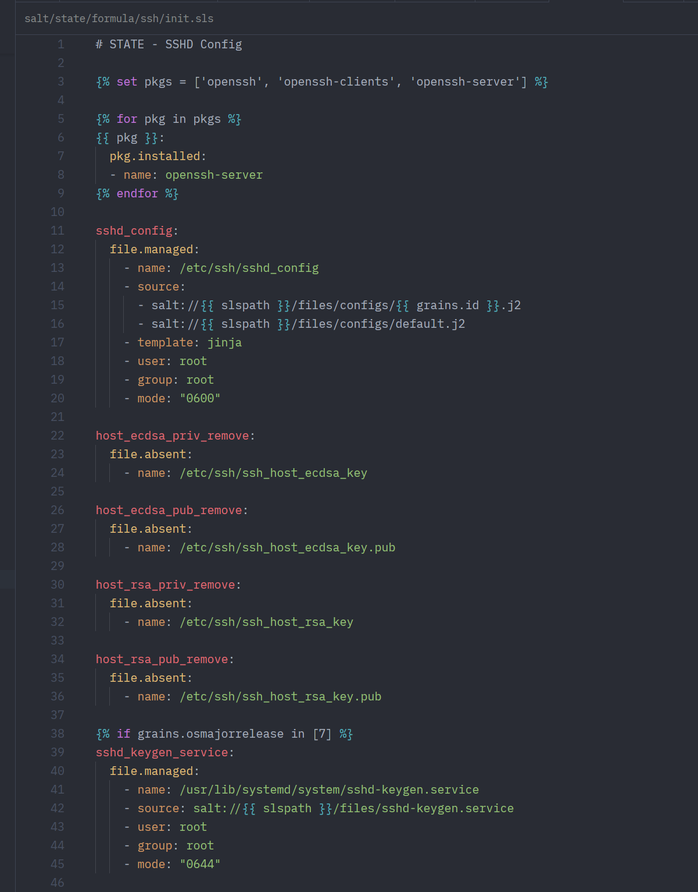

# SaltStack Jinja — Zed Extension

Syntax highlighting for SaltStack `.sls` files in the [Zed](https://zed.dev) editor.

Highlights YAML structure, Salt module calls, Jinja2 templates, and more — all in a single file type.

syntax hightlight example:




---

## What gets highlighted

| Element | Example | Color |
|---|---|---|
| State ID | `gitea_user:` | red/salmon |
| Salt module | `file.managed:` | yellow |
| Property key | `name:`, `uid:`, `mode:` | teal/blue |
| String value | `gitea`, `/bin/bash` | green |
| Number | `2978`, `644` | orange |
| Boolean | `True`, `False` | orange |
| Jinja expression | `{{ slspath }}` | cyan |
| Jinja block | ``, `` | purple |
| Jinja comment | `{# comment #}` | gray |

---

## Installation

### From the Zed Extension Registry (easiest)

1. Open Zed
2. Press `Cmd+Shift+X` (macOS) or `Ctrl+Shift+X` (Linux/Windows) to open Extensions
3. Search for **SaltStack Jinja**
4. Click **Install**

Done — any `.sls` file you open will automatically use the SaltStack Jinja syntax.

---

### Manual install (if not yet in the registry)

**Step 1 — Download the extension**

Download and unzip `zed-saltstack-jinja.zip`, or clone the repository:

```bash
git clone https://github.com/yourusername/zed-saltstack-jinja
```

**Step 2 — Install as a dev extension in Zed**

1. Open Zed
2. Press `Cmd+Shift+X` (macOS) or `Ctrl+Shift+X` (Linux/Windows)
3. Click **Install Dev Extension**
4. Select the `zed-saltstack-jinja` folder
5. Zed will compile the extension automatically (requires an internet connection the first time)

**Step 3 — Open a `.sls` file**

Open any SaltStack state file. Zed will automatically detect the `.sls` extension and apply the SaltStack Jinja syntax. You can also manually select the language by clicking the language name in the bottom-right corner of the editor and choosing **SaltStack Jinja**.

---

## Supported file types

| Extension | Description |
|---|---|
| `.sls` | SaltStack state and pillar files |
| `.jinja` | Standalone Jinja2 templates |
| `.jinja2` | Standalone Jinja2 templates |
| `.j2` | Jinja2 shorthand |

---

## Example

```yaml


gitea_user:
  user.present:
    - name: gitea
    - uid: 2978
    - shell: /bin/bash

gitea_service:
  file.managed:
    - source: salt://{{ slspath }}/files/gitea.service
    - template: jinja
    - user: gitea
    - mode: "0640"


gitea_enabled:
  service.running:
    - name: gitea
    - enable: True

```

---

## Troubleshooting

**The extension installs but `.sls` files show no highlighting**

Clear the extension cache and reinstall:

```bash
# macOS
rm -rf ~/Library/Application\ Support/Zed/extensions/installed/saltstack-jinja

# Linux
rm -rf ~/.local/share/zed/extensions/installed/saltstack-jinja
```

Then uninstall and reinstall the extension in Zed.

**The language doesn't appear in the language picker**

Check Zed's log for errors: open the Command Palette (`Cmd+Shift+P`) and search for **zed: open log**. Look for any lines mentioning `saltstack` or `jinja2`.

---

## License

MIT
